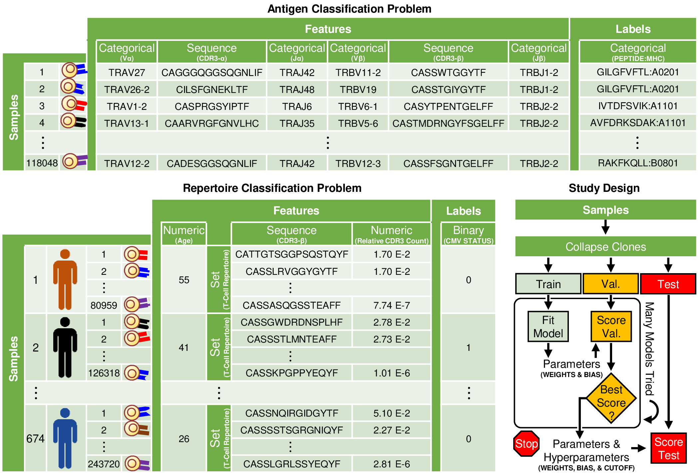

# Modelling Data that Do Not Conform to Rows and Columns: A Case Study of T-cell Receptor Datasets
###### Publication submitted for peer-review
###### JARED L OSTMEYER, ASSISTANT PROFESSOR, UT SOUTHWESTERN DEPARTMENT OF POPULATION AND DATA SCIENCES

## Introduction

Statistical classifiers are mathematical models that use example data to find patterns in features that predict a label. Most statistical classifiers assume the features are arranged into rows and columns, like a spreadsheet, but many kinds of data do not conform to this structure. Sequences are one example of a different kind of data, which is why this data is usually stored in a text document, not a spreadsheet. To build statistical classifiers for sequences and other non-conforming features, we have developed what we call *dynamic kernel matching* (DKM).

DKM is analogous to a convolutional network, but for sequences. Consider the problem of classifying a sequence. Because some sequences are longer than others, the number of features is irregular. Given a specific sequence, the challenge is to determine the appropriate permutation of features with weights, allowing us to run the features through the statistical classifier to generate a prediction. We use a sequence alignment algorithm to find the permutation of features that exhibit the maximal response, like how max pooling finds an image patch that exhibits the maximal response in a convolutional network. Given the immense number of possible permutations between features and weights, the problem appears computationally complex but can be solved in polynomial time using a sequence alignment algorithm. Here, we implement the Needleman-Wunsch algorithm [(link)](https://en.wikipedia.org/wiki/Needleman–Wunsch_algorithm) in TensorFlow. Equivalents to a sequence alignment algorithm exist for (i) sets, (ii) trees, and (iii) graphs, making it possible to use DKM on non-conforming features represented by these structures (*Unlike sequence alignment, the general problem of graph alignment is considered NP-hard*).

To illustrate the types of non-conforming features that we can handle with DKM, we consider two datasets of T-cell receptors, anticipating these datasets to contain signatures for diagnosing disease.

###### Antigen Classification Problem
10x Genomics has published a dataset of sequenced T-cell receptors labelled by interaction with disease particles, which are called antigens. We refer to this as the antigen classification problem. To solve the antigen classification problem, we use DKM to classify each sequence in this dataset. See the folder `antigen-classification-problem` for details [(link)](antigen-classification-problem/model).

###### Repertoire Classification Problem
Adaptive Biotechnologies has published a separate dataset of patients' sequenced T-cell receptors, which are called immune repertoires, labelled by those patients' cytomegalovirus (CMV) serostatus. We refer to this as the repertoire classification problem. To solve the repertoire classification problem, we use DKM to classify each set of sequences in this dataset. See the folder `repertoire-classification-problem` for details [(link)](repertoire-classification-problem/model).

###### Study Design
The training cohort is used to fit a model, the validation cohort is used for model selection, and the test cohort is used for reporting results. We strictly adhere to this protocol, ensuring that we avoid a model selection bias when reporting results.

## Requirements

* [Python3](https://www.python.org/)
* [TensorFlow == v1.14](https://www.tensorflow.org/)
* [NumPy](http://www.numpy.org/)
* [h5py](https://www.h5py.org/)
* Linux Environment (Recommended)

## Recommended Tools

* [HDF5 Database Viewer](https://www.hdfgroup.org/downloads/hdfview/)

## Download

* Download: [zip](https://github.com/jostmey/dkm/zipball/master)
* Git: `git clone https://github.com/jostmey/dkm`
