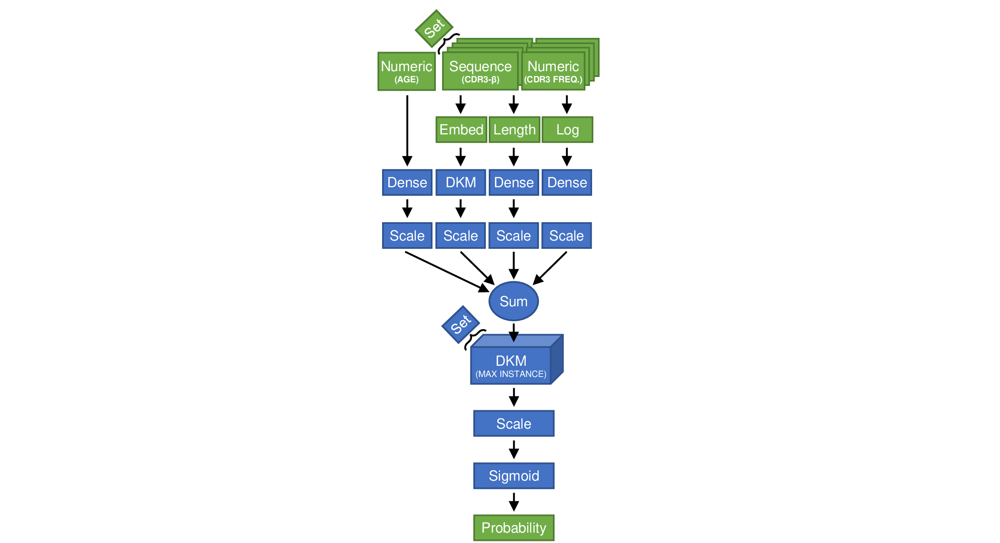

## Repertoire Classification Problem

To illustrate *dynamic kernel matching* (DKM) can be used to classify sets of sequence, we modify a logistic regression model with DKM and fit it to the repertoire classification dataset [(link)](https://github.com/jostmey/dkm/tree/master/repertoire-classification-problem/dataset). To handle sets of sequences, we apply DKM twice, first to handle the sequences and then again to handle the set. We handle sequences using the code from the antigen classification problem, and we handle the sets by taking the maximum scoring sequence.



## Model fitting

Each sequenced immune repertoire contains an average of over 100,000 receptors with almost 10,000,000 features per sample. Consequently, only one or a few immune repertoires can be fit into GPU memory at any given time. To fit the model to the training data, we rely on gradient aggreation. With gradient aggregation, each sample is feed into the model and gradients with respect to the cross-entropy loss function are computed. The samples are feed through the model one at time in a serial fashion. Afterwards, the gradients with respect to each sample are averaged together, achieving the same computation as if the gradient was computed with respect to the cross-entropy loss function over the samples.

## Running the model(s)

```
mkdir bin
python3 train_val.py --gpu 0 --database ../dataset/database.h5 --cohort_train Cohort_I --split_train samples_train --cohort_val Cohort_I --split_val samples_validate --output bin/model_1 > bin/train_val_1.out
python3 train_val.py --gpu 1 --database ../dataset/database.h5 --cohort_train Cohort_I --split_train samples_train --cohort_val Cohort_I --split_val samples_validate --output bin/model_2 > bin/train_val_2.out
python3 train_val.py --gpu 2 --database ../dataset/database.h5 --cohort_train Cohort_I --split_train samples_train --cohort_val Cohort_I --split_val samples_validate --output bin/model_3 > bin/train_val_3.out
python3 train_val.py --gpu 3 --database ../dataset/database.h5 --cohort_train Cohort_I --split_train samples_train --cohort_val Cohort_I --split_val samples_validate --output bin/model_4 > bin/train_val_4.out
python3 train_val.py --gpu 4 --database ../dataset/database.h5 --cohort_train Cohort_I --split_train samples_train --cohort_val Cohort_I --split_val samples_validate --output bin/model_5 > bin/train_val_5.out
python3 train_val.py --gpu 5 --database ../dataset/database.h5 --cohort_train Cohort_I --split_train samples_train --cohort_val Cohort_I --split_val samples_validate --output bin/model_6 > bin/train_val_6.out
python3 train_val.py --gpu 6 --database ../dataset/database.h5 --cohort_train Cohort_I --split_train samples_train --cohort_val Cohort_I --split_val samples_validate --output bin/model_7 > bin/train_val_7.out
python3 train_val.py --gpu 7 --database ../dataset/database.h5 --cohort_train Cohort_I --split_train samples_train --cohort_val Cohort_I --split_val samples_validate --output bin/model_8 > bin/train_val_8.out
```


